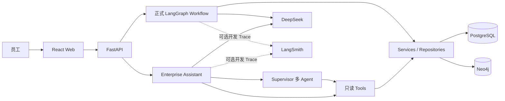
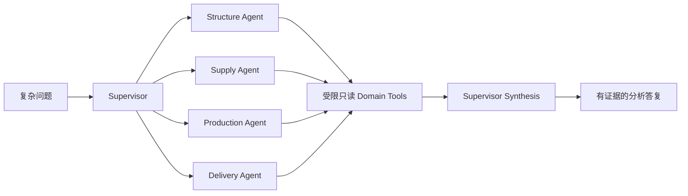
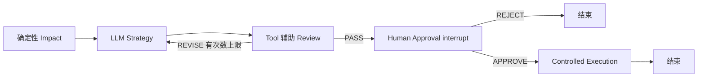

# ChangePilot

**V2 Feature Complete** — 一个面向制造业工程变更管理的可运行演示项目。它把产品物料清单（BOM）、供应商停产（Supplier EOL）、物料替代评估和工程变更记录连接起来：员工可以用自然语言查询企业事实；正式变更则必须经过影响分析、策略审查和人工审批。

项目使用 DeepSeek 的 LLM Tool Calling、Supervisor-Based Multi-Agent、LangGraph 工作流与 Human-in-the-loop。PostgreSQL 承载事务、会话、审计和 Checkpoint，Neo4j 承载产品结构关系；pytest、本地 Benchmark 与 LangSmith 分层验证行为。它是产品化学习与演示项目，**不是已接入真实 ERP/PLM 的生产系统**。

## 已实现能力

| 能力 | 当前实现 |
| --- | --- |
| Hybrid Enterprise Assistant | 多会话、PostgreSQL 消息与结构化上下文；通用问题可直接回答，企业事实须经只读 Tool |
| 企业 Tool Calling | BOM、Where-Used、替代料、库存、供应商、采购、生产、销售等查询；确定性实体与参数补全、事实保护 |
| Multi-Agent 协作 | Supervisor 按问题选择 Structure、Supply、Production、Delivery Agent；仅做只读分析 |
| 两条正式流程 | Supplier EOL 与 Material Substitution：Impact → Strategy → Review → Human Approval → Execution |
| 流程恢复与执行 | PostgreSQL Checkpointer 支持按 `thread_id` 跨进程恢复；APPROVE 后生成策略、ECO、Execution Job 等受控记录 |
| 可观测性与评测 | PostgreSQL AgentRun/Step/ToolCall/Audit；本地评测与可选 LangSmith Trace、Dataset、Experiment、Judge |

## 系统架构



简单企业查询使用对应 Tool，不进入 Multi-Agent；复杂跨域分析才由 Supervisor 分配领域任务。领域 Agent 只可调用各自白名单内的只读 Tool，Supervisor 汇总已核验事实。聊天建议可以预填正式流程字段，但 Multi-Agent 不会自动批准或执行变更。



两条正式流程复用受控审批路径。Review 的 `REVISE` 可有限次数返回 Strategy；`PASS` 才进入人工审批。LangGraph `interrupt` 在审批处暂停，PostgreSQL Checkpointer 保存状态，重启后用原 `thread_id` 恢复。`REJECT` 结束，`APPROVE` 才创建执行记录。



PostgreSQL 保存 ERP/ECM 业务事实、会话、Agent Trace、Audit 和独立的 LangGraph Checkpoint 表；Neo4j 保存产品、零件、版本、BOM、Where-Used 与替代关系。Checkpoint 是执行状态，不代替 ECM 业务记录。详见 [V2 架构说明](docs/change_pilot_v2_architecture.md)。

## 两个正式场景

- **Supplier EOL**：以 `BRG-6204-A`、`SUP-001` 为演示对象，核验产品、库存、采购与生产影响，再生成策略、审查、人工审批和受控执行记录。启动时仍须提供真实事件日期等必填信息。
- **Material Substitution**：以 `BRG-6204-A → BRG-6204-B` 为演示对象，确定性核验替代资格、Where-Used、供应和生产事实，随后走相同的策略—审查—审批—执行路径。

APPROVE 后会创建策略、ECO 与采购/生产/验证/交付等 Execution Job。物料替代流程可生成“准备 BOM Redline 草案”任务，**目前不创建 Redline 草案对象，也不伪造源 BOM 版本引用**。

## 快速启动

需要 Python 3.12、uv、Node.js/npm 和 Docker。先从 `.env.example` 复制出项目根目录 `.env`，填写 PostgreSQL、Neo4j 密码以及需要真实模型时的 DeepSeek Key；不要提交 `.env`。以下命令均在项目根目录运行：

```powershell
uv sync --extra dev
docker compose up -d
uv run alembic upgrade head
uv run python scripts/init_neo4j_schema.py
uv run python scripts/seed_golden.py
uv run uvicorn app.main:app --reload
```

迁移与 Golden Seed 初始化仅在需要准备本地数据时执行；日常重启后端不必重复执行。另开终端：

```powershell
cd web
npm ci
npm run dev
```

访问 [Web 演示](http://localhost:5173)、[FastAPI Docs](http://localhost:8000/docs)、[健康检查](http://localhost:8000/health) 和 [Neo4j Browser](http://localhost:7474)。Web 默认连接 `http://localhost:8000`；需改地址时在 `web/.env.local` 配置 `VITE_API_BASE_URL`。真实 Assistant、Strategy 与 Review 调用需要 `DEEPSEEK_API_KEY`；没有 Key 可运行使用 Fake LLM 的定向测试与本地 Benchmark，但无法完成真实模型 Demo。

`.env.example` 的关键配置按用途分组：

| 分类 | 字段 | 用途 |
| --- | --- | --- |
| Application | `APP_ENV`, `LOG_LEVEL` | 环境与日志级别 |
| PostgreSQL | `POSTGRES_HOST`, `POSTGRES_PORT`, `POSTGRES_DB`, `POSTGRES_USER`, `POSTGRES_PASSWORD` | 业务库与 Checkpoint 连接 |
| Neo4j | `NEO4J_URI`, `NEO4J_USER`, `NEO4J_PASSWORD`, `NEO4J_DATABASE` | 图数据库连接 |
| DeepSeek | `DEEPSEEK_API_KEY`, `DEEPSEEK_BASE_URL`, `DEEPSEEK_MODEL`, `LLM_TEMPERATURE`, `LLM_TIMEOUT_SECONDS`, `LLM_MAX_RETRIES` | 模型、超时和有限重试 |
| LangSmith | `LANGSMITH_TRACING`, `LANGSMITH_API_KEY`, `LANGSMITH_PROJECT` | 可选开发 Trace 与实验；关闭时产品仍可运行 |

## 7 步 Demo 路径

演示前按 [5 分钟检查清单](docs/demo_checklist.md)确认服务、密钥与 Golden Seed。真实模型的 Tool/Agent 选择会波动，演示时应展示实际结果及未核验项，而非预设“每次必成功”。

1. **通用模型能力**：问“什么是 BOM？”，展示无需企业 Tool 的中文解释。
2. **企业 Tool Calling**：问“BRG-6204-A 当前库存是多少？”，展示来自 Tool 的库存事实，而非模型猜测。
3. **Multi-Agent**：问“综合分析 BRG-6204-A 停产会对公司造成哪些影响？”，查看 Supervisor、领域 Agent、Tool Call 与 Agent 运行中心；若模型调度失败，展示 Trace 并说明边界。
4. **正式流程**：在 Web 启动 Supplier EOL 或 `BRG-6204-A → BRG-6204-B` 物料替代评估，查看 Impact、Strategy、Review 和待审批信息；事件日期由操作者填写。
5. **Checkpoint 恢复**：记录待审批的 `thread_id`，停止并重启后端，以该 ID 查询原流程，再提交 APPROVE 或 REJECT。
6. **Execution / Audit**：APPROVE 后展示 ECO、Execution Jobs、Agent Run Center 与关键 Audit；REJECT 不应产生执行记录。
7. **Evaluation**：运行下方本地 Benchmark，对照逐 Case 报告；若启用 LangSmith，再查看 Trace、Dataset 和 Experiment。

HTTP 入口包括 `/api/v1/assistant/conversations`、`/api/v1/workflows/supplier-eol`、`/api/v1/workflows/material-substitution`、`/api/v1/agent-runs` 和只读 `/api/v1/data/*`。具体请求字段与审批接口以 [FastAPI Docs](http://localhost:8000/docs) 为准。

## Evaluation 与当前结果

评测分三层：`pytest` 验证确定性工程行为；`evals/` 使用固定 Case、真实只读 Tool 和默认 Fake LLM 生成可复现报告；LangSmith 是可选的开发 Trace、Dataset、Experiment 和结构化 Judge，不替代本地事实校验。

```powershell
uv run pytest -q tests/unit/test_v28_evaluation.py tests/integration/test_hybrid_assistant.py tests/integration/test_multi_agent_assistant.py
uv run ruff check app evals tests
uv run python -m evals.run
uv run python -m evals.run --real-llm --limit 8 --output-dir evals/results-real
```

核心指标：Tool Selection Accuracy、Agent Selection Precision/Recall/Exact、Supervisor Routing Accuracy、Fact Grounding Rate、Unsupported Fact Rate、Workflow Suggestion Accuracy、Task Completion Rate 和延迟。客观库存数值、编号和替代资格由确定性规则评估；Judge 只评价分析、完整性和表达。

**V2.8 留存结果**：13 个 Benchmark Case；[Fake 报告](evals/results/assistant_v28.md) **12/13**（综合停产 Case 的现有结果为部分完成）；[真实 DeepSeek 8 Case 报告](evals/results-real/assistant_v28.md) **7/8**（供应风险 Case 的模型计划解析失败，未调用预期 Agent/Tool）。定向 pytest **30 passed、2 skipped**，Ruff 定向检查通过；关闭 tracing 的 Assistant/Workflow 回归为 **33 passed、2 skipped**。当前执行全仓 `ruff check app evals tests` 仍报既存的 `RUF022`（`app/db/postgres/models/__init__.py` 导出顺序），V2.9 文档阶段未修改该代码。结果不是 100%，且真实模型存在波动。数据集规模目前只有 13 Case，不能据此推断生产可靠性。

可选 LangSmith 数据集和实验需**显式**执行 `uv run python -m evals.langsmith_dataset`、`uv run python -m evals.langsmith_experiment --limit 2`；`--real-llm` 与 `--judge` 也是显式选项。已在 `ChangePilot-V2` 项目确认 Assistant、Supervisor、领域 Agent、Tool、DeepSeek LLM 的嵌套 Trace，并完成 Dataset/Experiment smoke test。详见 [评测说明](evals/README.md)。

## 目录导航

| 目录 | 职责 |
| --- | --- |
| `app/agents` | Assistant、Supervisor、领域 Agent 与正式流程 Agent |
| `app/api` | FastAPI 路由及跨请求 Workflow Runtime |
| `app/services` | 应用业务能力和事务边界 |
| `app/tools` | 可序列化、只读企业查询入口及 LangChain 适配 |
| `app/workflows` | 两条 LangGraph 流程、审批中断与 PostgreSQL Checkpointer |
| `app/db` | PostgreSQL ORM/Repository 与 Neo4j 驱动/查询 |
| `web` | React 智能工作台、企业数据中心与运行展示 |
| `evals` | 固定 Benchmark、指标、Runner 和可选 LangSmith 实验 |
| `tests` | 确定性单元与集成测试 |
| `docs` | 架构、面试复习、Demo 检查及历史设计 |
| `infra` | 基础设施相关文件；本地容器入口在根目录 `docker-compose.yml` |

## 当前边界与版本冻结

- 不真实写回 ERP/PLM、库存、采购、生产、销售，也不修改 Neo4j BOM。Execution 是受控记录和后续任务。
- BOM Redline 仅有准备任务，没有草案对象或伪造的 BOM 版本引用。
- 无登录/RBAC；当前本地演示方式不等于生产级安全或部署。
- Multi-Agent 只读分析不能绕过 Review、Human Approval；模型可能选错 Tool 或返回不符合 DTO 的计划。
- Benchmark 数据集小，Fake 运行验证结构和回归，不代表真实模型稳定性；LangSmith 仅用于开发观测和评测，不是生产运行依赖。

**V2 Feature Complete：V2 功能在此冻结。** 后续 V3 聚焦源码理解、手写关键模块以及 LangGraph、LangChain Tool Calling、Multi-Agent、PostgreSQL/Neo4j、Evaluation 的原理与已有边界优化；本次不新增第三场景或生产写回。
