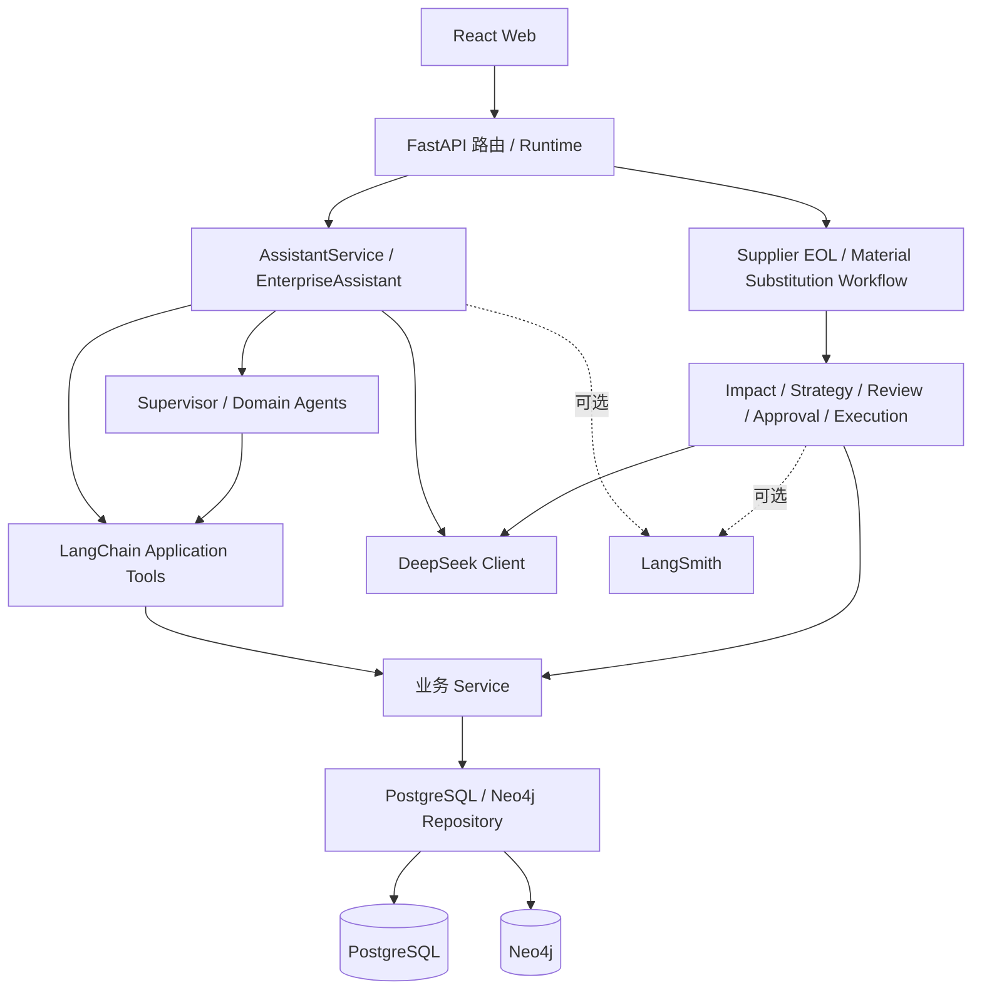
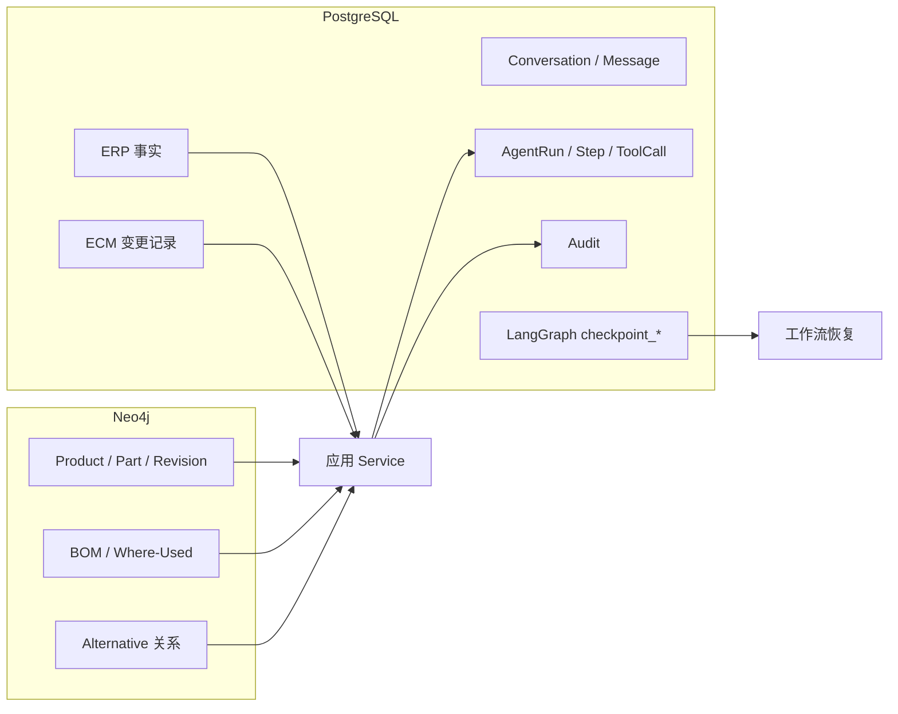
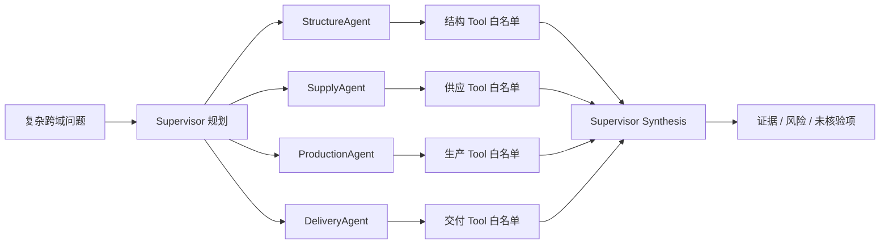
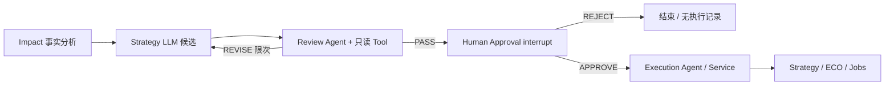

# ChangePilot V2 架构说明

本文记录 V2 已实现的边界与模块关系；演示入口、启动命令和当前评测结果见[根 README](../README.md)。V2 功能已冻结，不在此文档中描述未来功能为已实现。

## 1. 分层与存储

FastAPI 只负责请求/响应与 Runtime 接入；Tool 负责参数校验和可序列化边界；Service 执行业务计算或事务；Repository 负责持久化查询。Assistant 与 Agent 不直接写 SQL/Cypher。LLM 只处理通用语言、策略、审查或分析，不判定替代资格、库存和 BOM 等确定性事实。

PostgreSQL 的 `checkpoint_*` 是 LangGraph 官方 Checkpointer 独立维护的执行状态，不是 ECM 表的替代品；ECM 保存 Change Case、ECR、Impact、Strategy、ECO 和 Execution Job。Agent Trace 负责产品内运行记录与审计关联，LangSmith 仅用于开发调试和实验。Neo4j 保存产品结构及依赖关系，不承载审批事务。

## 2. Enterprise Assistant 与 Tool

`app/services/assistant.py` 从 PostgreSQL 读取并保存 Conversation、Message、`context_json`；`app/agents/enterprise_assistant.py` 根据当前问题和当前会话上下文解析实体。参数来源优先级是**本轮消息 → 本会话 context → 确定性版本/业务日期规则**，不会从其他会话取值。

通用概念或写作问题可直接使用 DeepSeek。涉及当前企业的 BOM、Where-Used、替代料、库存、供应、采购、生产和销售事实时，由 `app/tools/` 的只读 Tool 调用 Service/Repository。Tool 成功、无数据、缺参数和失败分别处理；没有成功事实不能把模型自由文本当作企业事实。一个问题可调用多个 Tool，模型分析与已查得事实分开呈现。聊天可在实体及必要事实满足条件后提出正式流程建议，但不会自行启动写流程。

## 3. Supervisor-Based Multi-Agent

`SupervisorAgent` 由 LLM 生成结构化计划，再按需调用领域 Agent；简单单事实查询无需经过 Supervisor。`app/agents/domain.py` 按领域限定可调用 Tool，领域结果带事实证据、风险和未知项。Synthesis 只能基于已核验结果概括，不能代表正式 ECM Impact、审批或执行。真实模型选择不保证稳定：V2.8 的一个真实供应风险 Case 因计划校验失败而未完成。

## 4. 两条正式 LangGraph Workflow

Supplier EOL 使用供应商事件（示例 `SUP-001`、`BRG-6204-A`）触发已有 EOL Impact Service；Material Substitution（示例 `BRG-6204-A → BRG-6204-B`）确定性核验原料与候选料资格、Where-Used、库存、采购和生产影响。两条路径的 LLM 主要用于 Strategy 与 Review。`REVISE` 回到策略生成且有次数上限；只有 Review `PASS` 才进入人工节点。Human Approval 使用 LangGraph `interrupt()`/`Command(resume=...)`，APPROVE 后才能执行，REJECT 结束。

`app/workflows/postgres_checkpoint.py` 使用 PostgreSQL `PostgresSaver`，首次使用时执行幂等 `setup()` 初始化其专用表。API Runtime 跨请求复用 Checkpointer；重新启动后可依 `thread_id` 查询和继续审批。ECM、Agent Trace、Audit 仍分别持久化；不能把 Checkpoint 当作唯一业务真值。重复审批/已结束线程由 Runtime 阻止或返回冲突，不应重复生成 Change Case/ECO/Job。

## 5. Execution 与可观测性

APPROVE 后 Execution Service 在 PostgreSQL 事务中保存选中 Strategy、Actions、ECO 和分类 Execution Jobs。它不调用真实 ERP/PLM 写接口，不改库存、订单或 Neo4j BOM。物料替代中的 `BOM_REDLINE_DRAFT` 只是“准备草案”任务，当前没有创建 Redline 草案对象或引用未经核验的源 BOM 版本。

业务运行记录保留在 PostgreSQL 的 AgentRun、AgentStep、ToolCall 与 AuditEvent，Agent 运行中心只读展示摘要。DeepSeek 使用 OpenAI-compatible 客户端；配置开启时 LangSmith 包装现有客户端并记录 Assistant、Supervisor、领域 Agent、Tool、LLM 的开发 Trace，关闭时不依赖 LangSmith 服务。Trace 不记录密钥或隐藏推理。

## 6. Evaluation 与现状边界

`pytest` 覆盖确定性工程行为；`evals/` 固定 Case Runner 默认使用 Fake LLM、真实只读 Tool，保存每 Case 指标；LangSmith Dataset/Experiment/Judge 必须显式使用。Tool/Agent 选择、路由、事实支撑、建议准确率、完成率与延迟分别统计；Judge 只评价主观分析质量，不能代替事实校验。当前数据集 13 Case，Fake 12/13，最近一次真实 DeepSeek 8 Case 中 7/8；失败与波动详见[评测说明](../evals/README.md)及[留存报告](../evals/results/assistant_v28.md)。

V2 当前不具备生产级 RBAC、真实 ERP/PLM 写回、真实 BOM 修改或大规模评测集。Multi-Agent 不能绕过审批。V3 应先理解并复现这些模块，再针对已观察到的模型计划稳定性和评测覆盖边界做优化。
